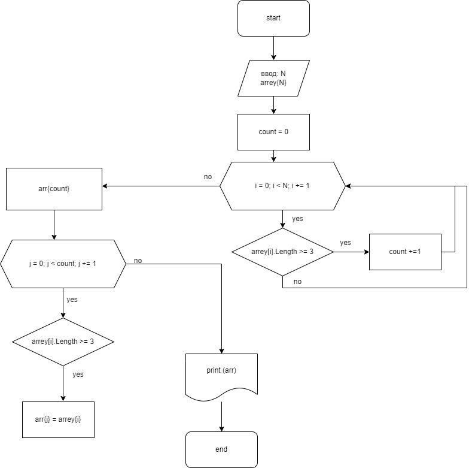

Программа Program.cs в папке dz формирует массив из элементов первоначального массива, длинна которых меньше либо равно 3 символам.
Этапы работы программы:
1. Запрос на ввод первоначального массива с терминала через пробел.
2. Вывод на экран первоначальнозаданного массива.
3. Проверка и подсчет всех элементов первоначального массива на соблюдение условия включения в новый массив (длина символов маньше или равно 3).
4. Формирование нового массива под нужное количество ячеек и заполнение его подходящими значениями из первоначального массива.
5. Вывод на экран итогового массива.

